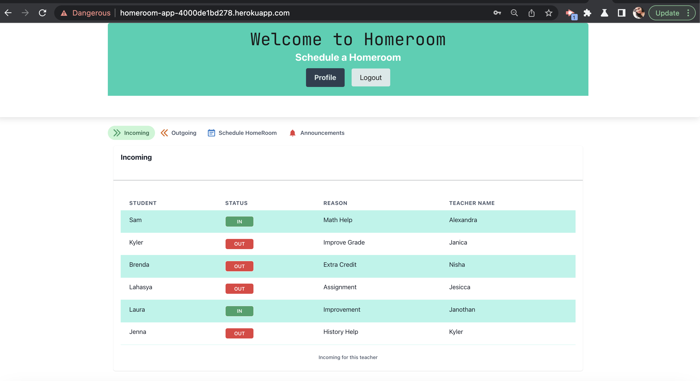
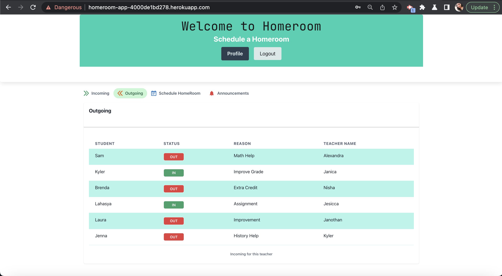
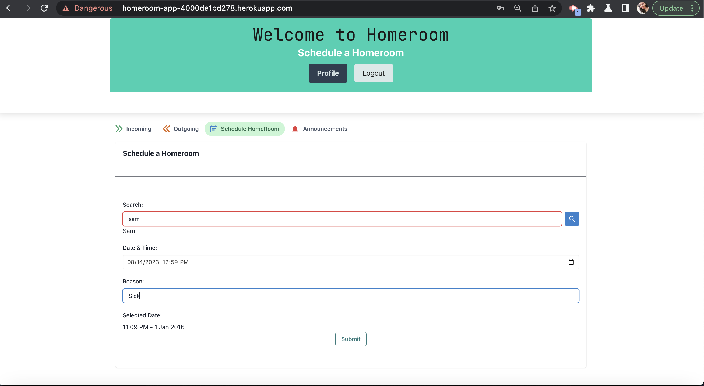
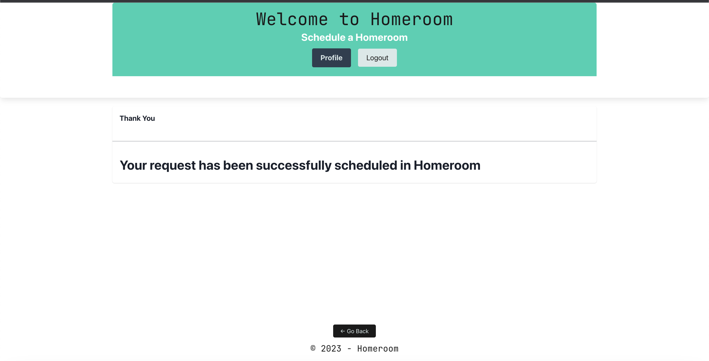

# HOME ROOM

# Do You Know Where Your Kids Are?

# User Story

AS A USER (teacher) I want to be able to see where my homeroom students are, and why they are there
SO THAT I can assign students out to different classrooms if needed and track attendance.

## Acceptance Criteria

GIVEN I am teacher trying to keep track of all my students.
WHEN I look at the application of Home Room
THEN I can view all my students and see if they need are requested to complete makeup work for another teather.
WHEN I send my student off to the next teacher,
THEN I can see if they made it to the new home room or the skipped.

## Description

This website will provide teachers with an easier way to keep track of kids during free periods. They can also see if students are requested by another teacher, comment why they need to be in a certain classroom, and mark if they are still in my class or on the way via a toggle button.
 
## Usage

This website could be used throughout all schools as a simple yet effective way to keep track of students and make sure free period is used for makeup work if needed, also should bring up attendance and accountability. In order to use, one must make an account. In theory, they would be linked to their homeroom class period and those students would be able to be requested by other teachers. The app as it stands is missing almost all funcionality as the time was limited to troubleshoot the middleware. Many iterations had separate pieces working but, not together. The app needs more work. However, there is successful implementation of React, GraphQL (profile creation), Express, and Node so we will continue to work but hope that we satisfied some basic requirements.

Heroku Deployed website can be found at: https://homeroom-app-4000de1bd278.herokuapp.com/
### Incoming

### Outgoing

### Schedule

### Request Submission

## Credits

- Alexandra Winter
- Janica Jensen
- Kyler Peterson
- Nishanthi Govindasamy

## License

MIT License
Copyright (c) 2023 AWinterCoding

Permission is hereby granted, free of charge, to any person obtaining a copy of this software and associated documentation files (the "Software"), to deal in the Software without restriction, including without limitation the rights to use, copy, modify, merge, publish, distribute, sublicense, and/or sell copies of the Software, and to permit persons to whom the Software is furnished to do so, subject to the following conditions:

The above copyright notice and this permission notice shall be included in all copies or substantial portions of the Software.
